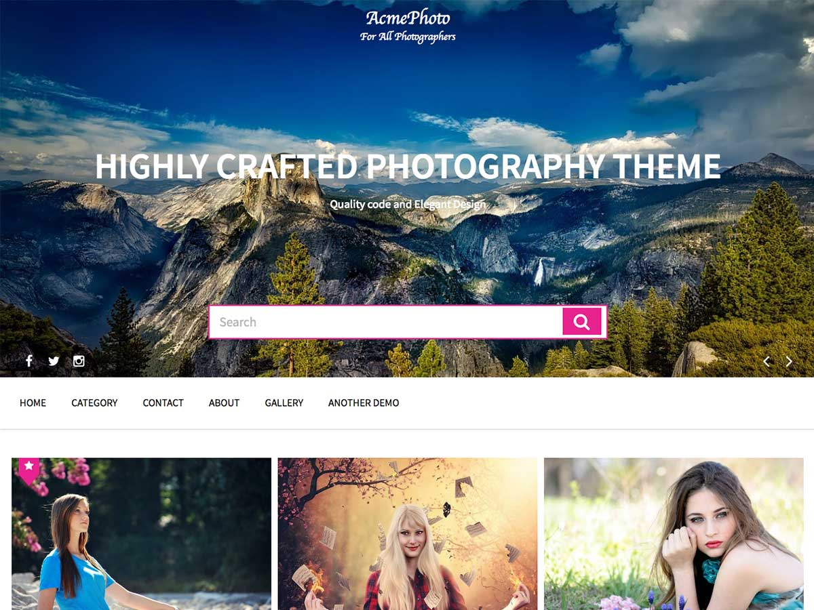

# AcmePhoto

**Contributors:** acmethemes  
**Requires at least:** 6.6  
**Tested up to:** 7.0  
**Requires PHP:** 7.4  
**Stable tag:** 4.0.0  
**License:** GPLv2 or later  
**License URI:** https://www.gnu.org/licenses/gpl-2.0.html  

> 

AcmePhoto is a photography WordPress theme built around a stunning masonry layout. Designed for photographers, artists, freelancers, and creative portfolios, it puts your visuals front and center with a clean, distraction-free canvas. Every pixel is crafted to make your work look its best.

## Features

- **Masonry grid layout** — images flow naturally like a gallery wall
- **Up to four columns** — one, two, three, or four-column layouts
- **Featured slider** — full-width or boxed, with adjustable height
- **Multiple menu positions** — top, primary, and more
- **Advanced pagination** — numbered, ajax, or infinite scroll
- **Flexible sidebar** — left, right, or full-width options
- **Custom colors & background** — personalize with ease
- **Post formats** — gallery, image, video, and standard support
- **Related posts** — by category or tag
- **Breadcrumb navigation** — clear site structure
- **Social icons** — link your Instagram, Flickr, 500px, and more
- **Custom widgets** — purpose-built for photography sites
- **Translation ready** — .pot file included
- **WooCommerce ready** — sell prints and products directly
- **RTL support** — right-to-left language compatible

## Installation

1. Download the theme zip file.
2. In your WordPress admin, go to **Appearance → Themes**.
3. Click **Add New** → **Upload Theme**.
4. Select the zip file and click **Install Now**.
5. Click **Activate**.

## Frequently Asked Questions

### How do I install the theme?

In your admin panel, go to **Appearance → Themes**, click **Add New**, upload the zip file, and activate.

### How do I customize the theme?

Go to **Appearance → Customize** — all theme options are available there, including slider settings, layout choices, and color schemes.

## Credits

AcmePhoto is built on [Underscores](https://underscores.me/) and licensed under GPLv2 or later. It bundles the following third-party resources:

- [Google Fonts](https://fonts.google.com/) — Apache License 2.0
- [Font Awesome](https://fontawesome.com/) — MIT / SIL OFL 1.1
- [normalize.css](https://necolas.github.io/normalize.css/) — MIT
- [Cycle2](http://jquery.malsup.com/cycle2/) — MIT/GPL
- [Theia Sticky Sidebar](https://github.com/WeCodePixels/theia-sticky-sidebar) — MIT
- [Breadcrumb Trail](https://github.com/justintadlock/breadcrumb-trail) — GPLv2+
- [TGM Plugin Activation](http://tgmpluginactivation.com/) — GPLv2+
- [html5shiv](https://github.com/afarkas/html5shiv) — MIT
- [Respond.js](https://github.com/scottjehl/Respond) — MIT

---

[Demo](http://demo.acmethemes.com/acmephoto) &middot; [Support](https://www.acmethemes.com/supports/) &middot; [Acme Themes](https://www.acmethemes.com)
